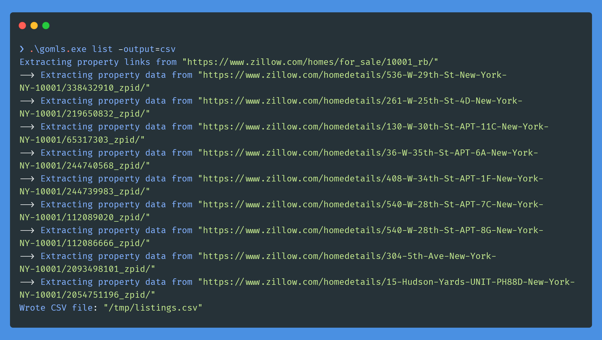

# gomls

[](https://github.com/TsekNet/gomls/blob/master/LICENSE)[](https://github.com/TsekNet/gomls/actions/workflows/release.yml)

Command-line tool that scrapes real estate listings from the web (with filters).

## Installation

Download the [executable](https://github.com/TsekNet/gomls/releases) from `/releases` (right side menu).

## Usage

```sh
.\gomls_windows.exe -help
Usage: .\gomls.exe <flags> <subcommand> <subcommand args>

Subcommands:
        commands         list all command names
        flags            describe all known top-level flags
        help             describe subcommands and their syntax

Subcommands for Lists items with optional output format:
        list             Lists items with optional output format


Top-level flags (use ".\gomls.exe flags" for a full list):
  -verbose=true: print info level logs to stdout
  ```

```sh
.\gomls_windows.exe list -help
gomls.exe list
  -baths int
        Filter by number of baths
  -beds int
        Filter by number of beds
  -location string
        Filter by location of the properties (can be neighborhood, zip code, etc.).
        Type this into your search bar on zillow.com if you want to confirm the format. (default "10001")
  -output string
        Output format
        Must be one of: [plain, json, html, csv] (default "plain")
  -price int
        Filter by price
  -property_type string
        Filter by property type
        Must be one of: [APARTMENT, CONDO, MULTI_FAMILY, SINGLE_FAMILY]
  -sold
        Filter by sold properties
```

## Screenshots

> 💡 See the /examples folder for sample output files

### CSV output



### HTML output, all filters


## Background

As a side project, mostly to get more comfortable with Go I aimed to build a tool that would scrape zillow.com for recent listings and sales. I aimed to allow flexible output types via a cross-platform (Linux, Mac, Windows) binary that can be shipped to friends to run on their systems. I also wanted to learn more about web scraping in Go (as opposed to using Python's `beautifulsoup` library). I didn't find any free, open source web scrapers for real estate data when searching online. All the ones I found were either a Chrome extension, or a paid API.

## Visualize Listings in Google Maps

An example of where data exported from this binary becomes useful is importing the CSV into Google Maps via the steps below:

First Execute `gomls list -output=csv` with the appropriate filters (price, location, beds, etc.).

### Import into Google Maps

1. Navigate to [GoogleMy Maps](https://www.google.com/maps/d/u/0/home?hl=en&hl=en) in your desktop browser of choice
1. Click New icon (red circular button, bottom right)
1. Click `Create`
1. Click `Import` (under `Untitled layer`)
1. In the `Upload` dialogue, click `Browse` and navigate to your computer's temp directory, where you will find `listings.csv`
1. Choose the `Address` when asked to `Choose columns to position your placemarks`
1. Choose either `Address` when asked to `Choose a column to title your markers`

### Style your custom Map

1. Click `Individual Styles` (under `listings.csv`)
1. Chose `Beds` for Group Places by
1. Chose `ListPrice` or `SoldPrice` for `Set Labels`
1. Enjoy your very own visualization of listings in Google Maps!

Screenshot below as an example:


## Contributing

Pull requests are welcome. For major changes, please open an issue first to discuss what you would like to change.

Please make sure to update tests as appropriate.
